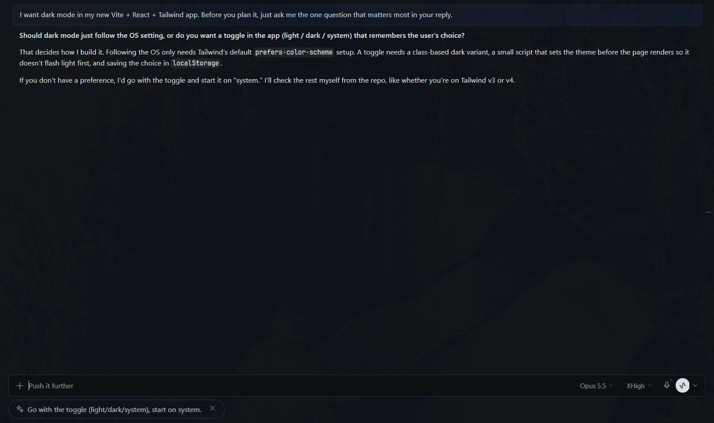
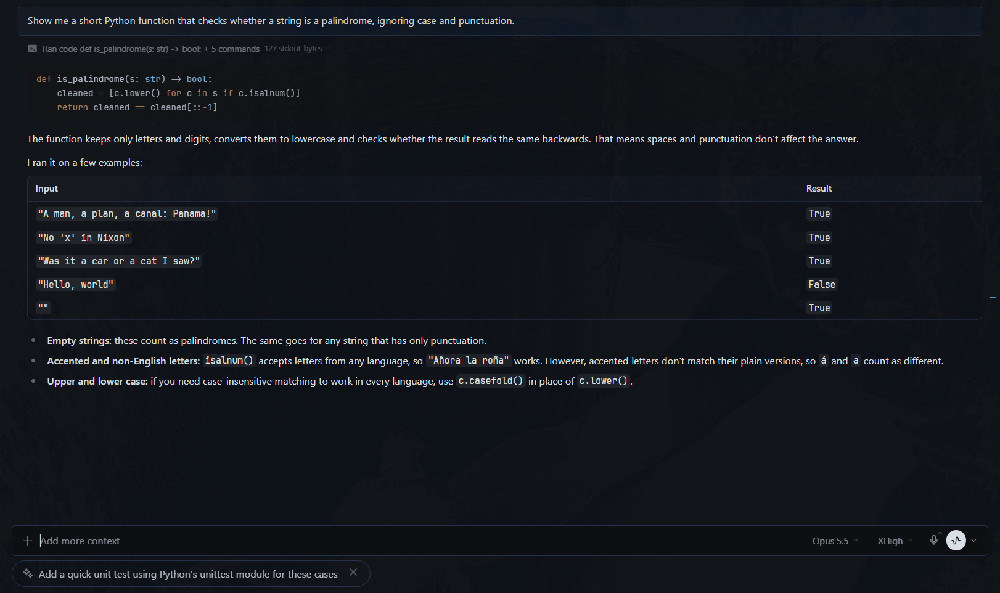
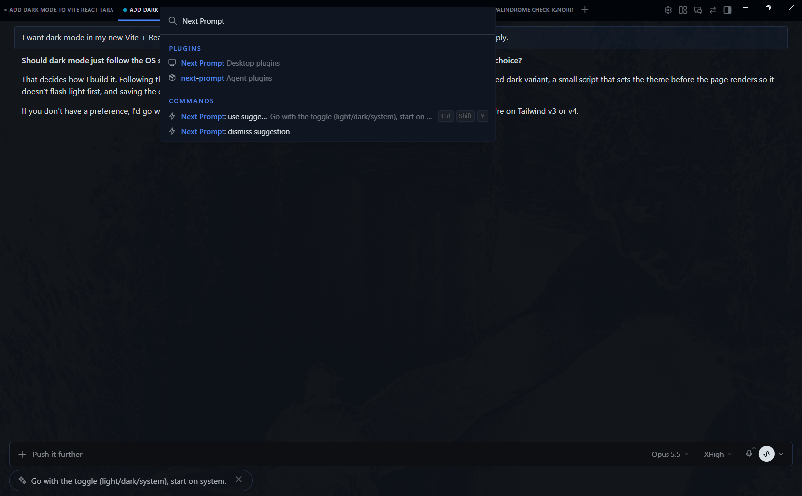

# Next Prompt

A [Hermes Agent](https://github.com/NousResearch/hermes-agent) Desktop plugin
that suggests your next message after every turn. It shows up as a small pill
under the composer:

- **When the agent asks you something**, the pill is the answer you would most
  likely give, committed to one option.
- **Otherwise**, it is the natural next step: verify it, apply it elsewhere,
  dig into a detail.

Click it, or press **Ctrl/⌘+Shift+Y**, and the text lands in the composer for
you to review. **Nothing is ever sent for you.**

## Install

```bash
hermes plugins install next-prompt
hermes plugins enable next-prompt
```

Restart Hermes Desktop, then turn **Next Prompt** on in **Settings → Plugins**
(desktop plugins are opt-in). Requires Hermes Agent ≥ 0.21 with the Desktop app.

## What it looks like

**The agent asked a question.** The pill is your likely answer, ready to send
or tweak:



**The agent finished a task.** The pill is the natural next step:



**Command palette.** Ctrl/⌘+K → *Next Prompt: use suggestion* (with a preview)
or *dismiss suggestion*:



## Using it

- **Click the pill** or press **Ctrl/⌘+Shift+Y** to use the suggestion. The
  shortcut only acts on the suggestion shown in the chat you are looking at,
  and does nothing while that chat is working. Change it in
  **Settings → Keybinds**.
- **Click ×** to dismiss it. Sending your own message clears it too.
- **It stays until you act on it.** Switching chats or screens, or restarting
  the backend, does not lose it. Stale suggestions expire after 7 days.
- **When a suggestion can't be generated**, a muted note takes the pill's
  place and says why (credentials rejected, rate limit, timeout) with a hint
  on hover. It never shows the provider's error text.

On Desktop builds with the plugin SDK's composer API
(`host.composer.insertText`), using a suggestion puts the text straight into
the composer. On earlier builds it copies the text to the clipboard and tells
you so; paste it with Ctrl/⌘+V.

## Choosing the model

Suggestions run on your **main model** unless you give the plugin's auxiliary
task its own. A small, fast model is plenty and far cheaper than an Opus-class
main model:

```bash
hermes config set auxiliary.next_prompt.provider anthropic
hermes config set auxiliary.next_prompt.model claude-sonnet-5
```

`hermes config set` warns that the key is not recognized: plugin tasks are
registered at runtime, and the value is still read. You can also pick it
interactively with `hermes model` → **Auxiliary** → **Next Prompt**. (Desktop's
Settings → Models → Auxiliary lists only Hermes' built-in tasks.) The change
applies from the next suggestion; no restart needed.

Measured on 16 conversations in English and Spanish (6 where a next step fits,
8 where the agent asked you something, 2 where the right answer is silence; 4
of them real exchanges scored against the reply actually sent), each run two
or three times and scored by an LLM judge:

| Model | Correct | Median latency | Notes |
|---|---|---|---|
| `claude-opus-5-5` | 30/32 | 1.5 s | Most useful suggestions; the most expensive |
| `claude-sonnet-5` | 43/48 | 1.2 s | Recommended balance |
| `gpt-6-luna` (reasoning off) | 25/32 | 1.8 s | Much cheaper; sometimes follows the topic's language instead of yours, or stays silent when a reply fits |

"Correct" means you would send it as is or after changing a word or two, in
your language, committed to one answer (no options or blanks), with silence
exactly where it should be. The miss all three share: when you report on a
test, the suggestion assumes it went well, so you fix a word when it didn't.

### Settings

```yaml
plugins:
  entries:
    next-prompt:
      settings:
        enabled: true            # toggle suggestions on/off
        max_context_messages: 4  # your last N/2 requests + the agent's reply to each (2-10)
        cooldown_seconds: 3      # minimum gap between suggestions per chat
```

## Privacy and cost

- Per completed turn, the model receives your last few requests and the
  agent's **final** reply to each (2 of each by default), each clipped to
  about 1,200 characters keeping the start and the end. Tool calls, tool
  output and the agent's intermediate notes are never sent.
- One short completion per turn (`max_tokens=100`, about 900 input tokens with
  Anthropic models), on the model you choose.
- Messaging platforms (Telegram, Discord, …) are skipped: nobody would see the
  pill there, so no call is spent on them.
- No telemetry and no network access other than the host's own `ctx.llm` call.

## How it works

1. **`post_llm_call` hook.** When a turn finishes in a Desktop/TUI session, a
   background worker asks `ctx.llm` for the message you are most likely to
   send next: your answer when the agent asked you something, otherwise a
   next step. `NULL` only when the exchange is closed (thanks, goodbye).
2. **Per-chat storage.** The suggestion is kept in the plugin's data directory
   (`ctx.state.data_dir`, under the profile's `plugin-data/`) until you use
   it, dismiss it, or send your own message (`pre_llm_call`).
3. **Desktop half.** Reads the suggestion through the plugin's REST route
   (`ctx.rest` → `/api/plugins/next-prompt/suggestion`) and renders it in the
   `composer.underside` area.

### Design notes

- **Pill, not ghost text.** The plugin SDK does not expose the composer's
  input, so the suggestion lives in `composer.underside`, a first-class
  extension area.
- **Insert, don't send.** Using a suggestion only places the text for you to
  review. The bundle stays inside the plugin SDK: it never touches the app's
  composer DOM or internal events, so composer changes can't break it
  silently.
- **Poll, not push.** `ctx.socket` is a no-op on OAuth remote backends, so the
  desktop half polls (every 2 s right after a turn, every 20 s otherwise).
- **One answer, never a menu.** When the agent ends with a question, a choice
  or a yes/no offer, the suggestion commits to the option the conversation or
  the agent favours, or says yes to a proposal that matches your request.
  Asked to try something and report back, it confirms you did it with the
  most likely outcome. It never offers a list of options or a blank to fill
  in, since deleting options is as much work as typing; a suggestion that
  comes back with brackets anyway is dropped. When the answer is a detail only
  you know (an email address), it shows nothing. It never includes a password.
- **Your language.** The suggestion follows the language of your last
  message, not the topic's.

## Development

```bash
git clone https://github.com/soymarketing/hermes-plugin-next-prompt
cd hermes-plugin-next-prompt
hermes plugins validate .

# tests (need hermes-agent importable, e.g. its venv, and Node 22+)
python -m unittest discover -s tests -v
node --test "tests/frontend/*.test.mjs"
node tests/check_sdk_exports.mjs /path/to/hermes-agent

# try it
cp -r . "$HERMES_HOME/plugins/next-prompt"
hermes plugins enable next-prompt
```

The same checks run in GitHub Actions on every push and pull request. Python
changes need a full Desktop restart (quit it from the system tray too);
`desktop/plugin.js` hot-reloads. See [CHANGELOG.md](CHANGELOG.md) for release
notes.

## License

MIT
